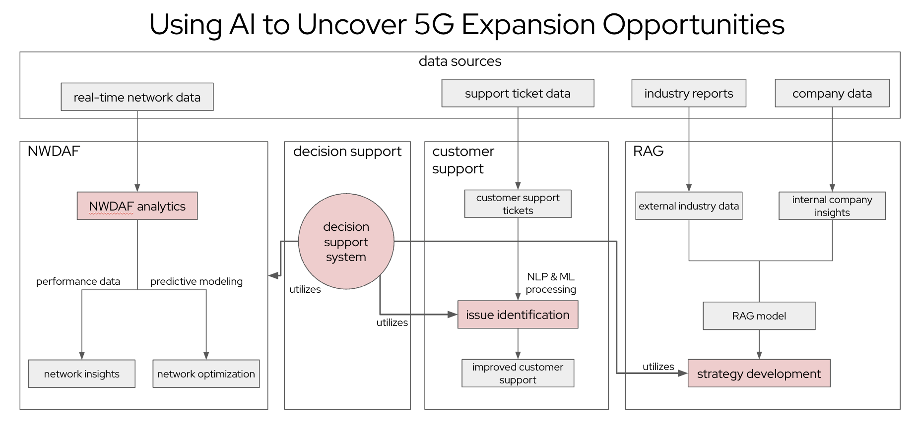
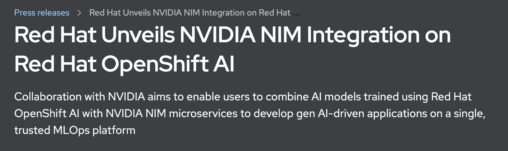
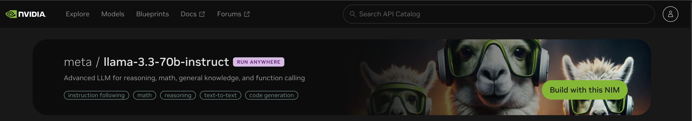

# mwc-2025-using-ai-5g-expansion
mwc-2025-using-ai-5g-expansion

## Architecture

Red Hat Integration with NVIDIA NIMs

https://www.redhat.com/en/about/press-releases/red-hat-unveils-nvidia-nim-integration-red-hat-openshift-ai

https://docs.nvidia.com/nim-operator/latest/install-openshift.html

https://docs.nvidia.com/nim-operator/latest/install-openshift.html

NVIDIA NIM / APIs (Run Anywhere)

https://build.nvidia.com/meta/llama-3_3-70b-instruct